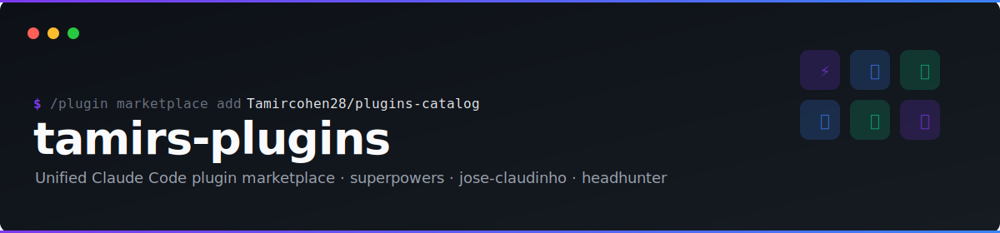

<p align="center">
  
</p>

<h1 align="center">tamirs-plugins</h1>

<p align="center">
  <a href="https://github.com/Tamircohen28/plugins/actions/workflows/ci.yml">
    
  </a>
  <a href="LICENSE">
    
  </a>
  
  
  
</p>

<p align="center">
  A unified multi-platform plugin catalog for <a href="https://github.com/Tamircohen28">@Tamircohen28</a> — one marketplace install for <a href="https://docs.anthropic.com/en/docs/claude-code">Claude Code</a>, <a href="https://cursor.com/docs/plugins">Cursor</a>, and <a href="https://developers.openai.com/codex/plugins">Codex</a>.
</p>

---

## Features

- **Single install point** — add one marketplace to get all plugins, no per-repo configuration
- **Catalog only** — this repo holds marketplace manifests only; plugin source lives in each plugin's own repo
- **Multi-platform** — Claude, Cursor, and Codex manifests generated from one canonical source
- **Auto-updated** — each plugin entry pins a branch so you always get the latest compatible version
- **Schema-validated** — CI regenerates and validates all manifests on every push
- **Production plugins** — browse the catalog below to see all available plugins, ready to install

## Plugins

| Plugin | Repo | Description |
|--------|------|-------------|
| `tamirs-superpowers` | [Tamircohen28/tamirs-superpowers](https://github.com/Tamircohen28/tamirs-superpowers) | Skills, smart worktree hooks, statusline, and MCP stubs for a full dev workflow. |
| `jose-claudinho` | [Tamircohen28/jose-claudinho](https://github.com/Tamircohen28/jose-claudinho) | AI manager for Sport5 Fantasy World Cup 2026. |
| `headhunter` | [Tamircohen28/headhunter](https://github.com/Tamircohen28/headhunter) | Job-search CRM with Gmail/Calendar/Notion/Todoist integrations. |

## Quick Start

### Claude Code

Inside Claude Code or from the `claude` CLI:

```bash
# 1. Add this marketplace
claude plugin marketplace add Tamircohen28/plugins

# 2. Install the plugins you want
claude plugin install tamirs-superpowers@tamirs-plugins
claude plugin install jose-claudinho@tamirs-plugins
claude plugin install headhunter@tamirs-plugins

# 3. Confirm they're installed
claude plugin list
```

Slash-command equivalent inside Claude Code:

```text
/plugin marketplace add Tamircohen28/plugins
/plugin install tamirs-superpowers@tamirs-plugins
/doctor
```

### Codex

```bash
# 1. Add this marketplace (sparse checkout keeps the clone small)
codex plugin marketplace add Tamircohen28/plugins --ref main --sparse .agents/plugins

# 2. Install plugins
codex plugin install tamirs-superpowers --source plugins
codex plugin install jose-claudinho --source plugins
codex plugin install headhunter --source plugins

# 3. List installed plugins
codex plugin list
```

In the Codex app: **Settings → Plugins → + Add More…** and paste `https://github.com/Tamircohen28/plugins`.

### Cursor — team marketplace (Teams / Enterprise)

Org admins import this repo as a private team marketplace:

1. **Dashboard → Settings → Plugins → Import Marketplace**
2. Repository: `https://github.com/Tamircohen28/plugins`
3. Save and assign distribution groups

Developers install optional plugins from the in-editor marketplace panel.

### Cursor — local development (any user)

Test a plugin locally before it is published or indexed remotely:

```bash
git clone https://github.com/Tamircohen28/tamirs-superpowers
ln -s "$(pwd)/tamirs-superpowers" ~/.cursor/plugins/local/tamirs-superpowers
```

Restart Cursor or run **Developer: Reload Window**.

> Listed plugin repos must ship `.cursor-plugin/plugin.json` and `.codex-plugin/plugin.json` for Cursor and Codex installs to succeed. See [Troubleshooting](docs/user/troubleshooting.md).

## Documentation

Full user guide, concepts, and troubleshooting are in [`docs/`](docs/README.md).

## Contributing

See [`docs/CONTRIBUTING.md`](docs/CONTRIBUTING.md) — edit the Claude manifest, run `make generate`, and open a PR.

## License

MIT © [Tamir Cohen](https://github.com/Tamircohen28)
